# Descripción
Kiosko-SSMS es una aplicación de escritorio ligera y portable para la gestión de ventas (enfocado en un negocio pequeño) desarrollada utilizando C#, .NET y WinForms.

## Características
- Gestión de productos (CRUD)
- Gestión de proveedores (CRUD)
- Gestión de clientes (CRUD)
- Comprobantes de venta (Exportar a PDF, busqueda)
- Tipos de Pagos (Visualizar, editar y eliminar)
- Tipos de Comprobantes de Venta (CRUD)
- Gestión de presentaciones de productos (CRU)
- Gestión de usuarios (CRUD)
- Permisos simples (GERENTE-VENDEDOR)
- Configuración de la aplicación: Nombre y valor del impuesto de venta, configuración de moneda, nombre, dirección, cod. tributario de empresa y herramienta de inicio.

## Tecnologías y dependencias
- [.NET 4.8](https://dotnet.microsoft.com/en-us/download/dotnet-framework/net48) (Framework)
- [WinForms](https://learn.microsoft.com/en-us/dotnet/desktop/winforms/overview/) (GUI)
- [Krypton Toolkit](https://github.com/ComponentFactory/Krypton) (Controles para WinForms)
- [SQLite](https://sqlite.org/) (Base de Datos)
- [iTextSharp](https://github.com/itext/itextsharp) (Librería para PDF)
- [EntityFramework](https://learn.microsoft.com/en-us/aspnet/entity-framework) (ORM)

## Requisitos
- .NET >=4.8
- Windows 7 SP1 en adelante

## Uso
Puedes dirigirte a la sección de [releases](https://github.com/zNahuelz/kiosko-ssms/releases) para descargar el archivo ejecutable. Una vez descargado, puedes utilizar la aplicación:
- Descomprimir el archivo .zip
- Ejecutar el programa (kiosko-ssms.exe)
- La base de datos es generada automáticamente y es el archivo kiosko.db en el mismo directorio del ejecutable.
- El primer inicio de sesión puede realizarse con las siguientes cuentas, posteriormente puedes crear o modificar las existentes desde la aplicación:

| Usuario | Contraseña | Rol          |
| ------  | ------ | ------           |
| root@kiosko.com | r00to  | Gerente  |
| admin@app.com   | admin  | Gerente  |
| seller@app.com  | seller | Vendedor |

## Imágenes
Inicio de sesión

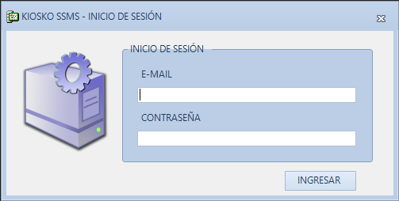

Ventana principal de la aplicación
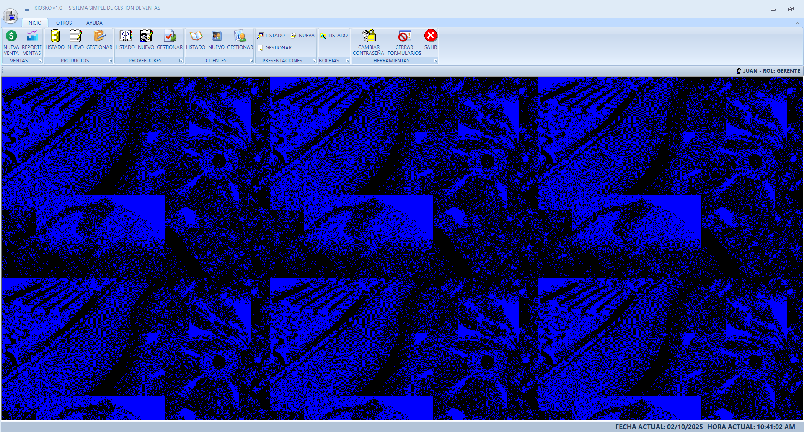

Configuración de la aplicación
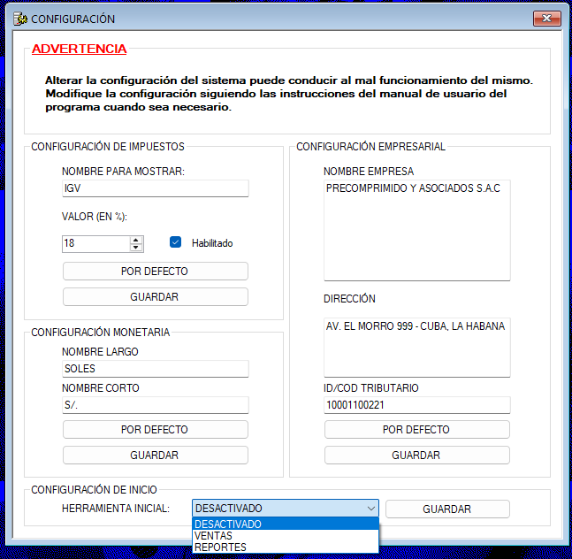

Registro de usuario, cliente y proveedor
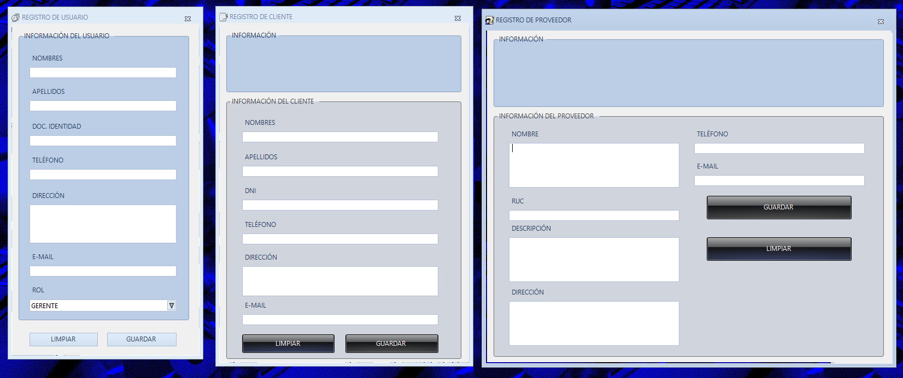

Nueva Venta
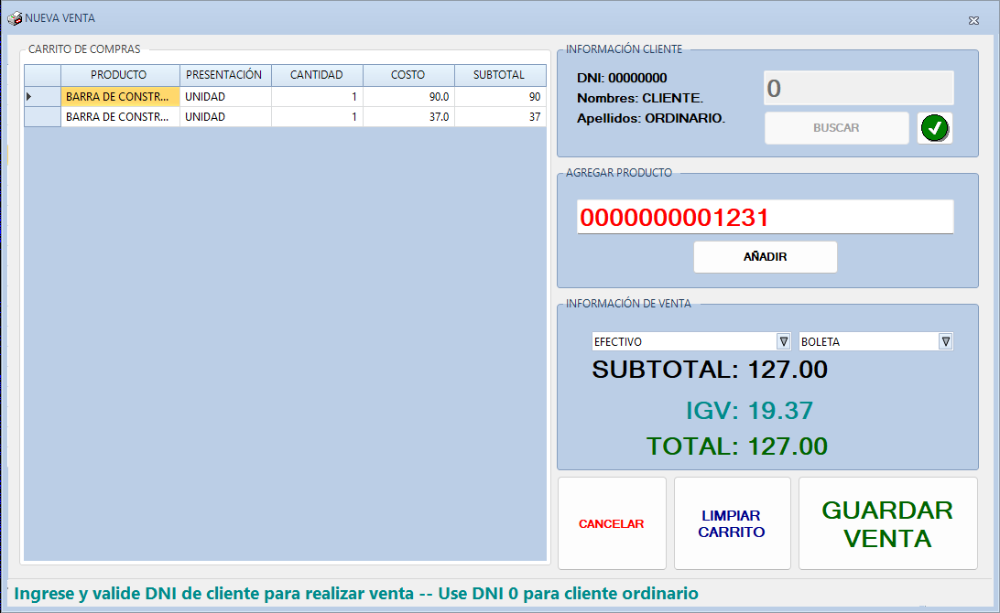

Listado de Productos
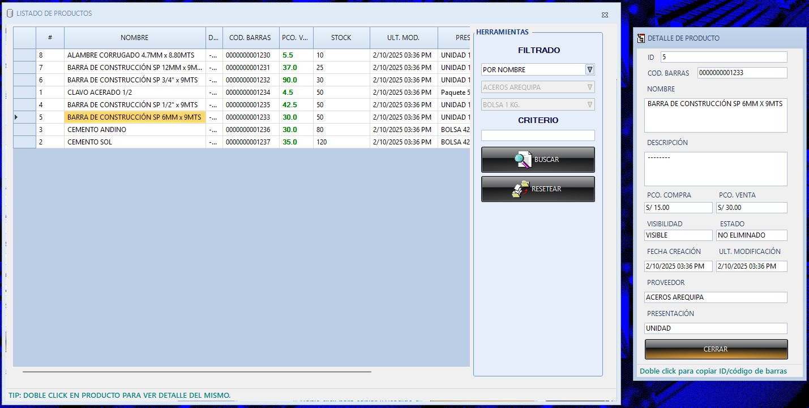

Listado de Comprobantes de Venta
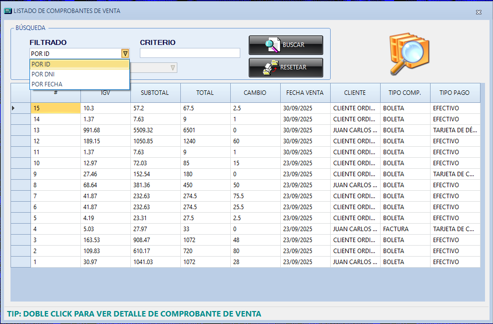

Detalle de Comprobante de Venta
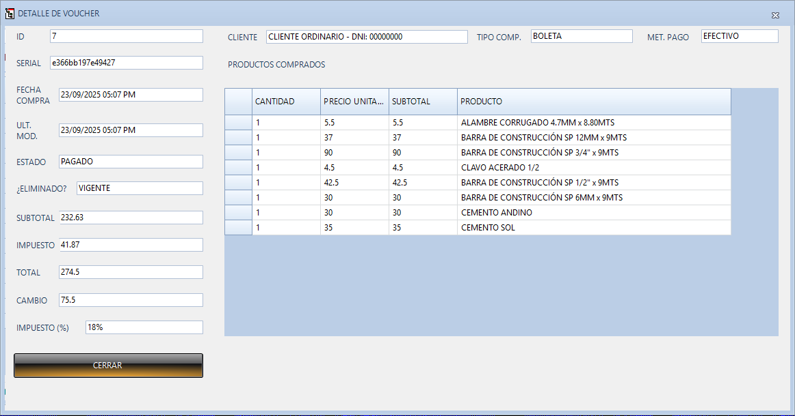

Comprobante de Venta en PDF
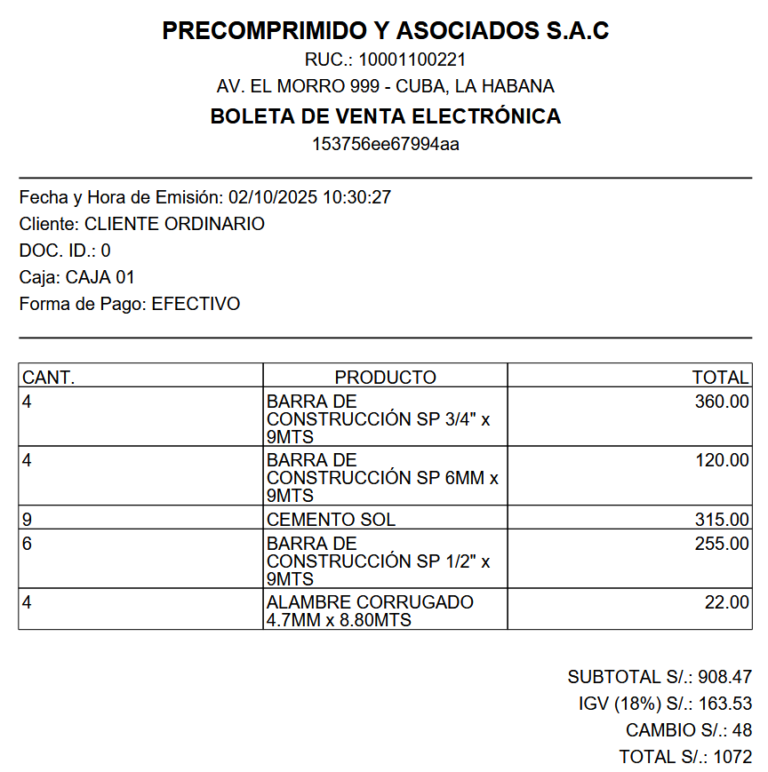

Reporte de Ventas (Ingresos-Impuestos)
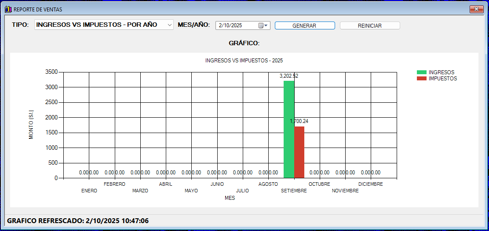

Reporte de Ventas (Producto más vendido)
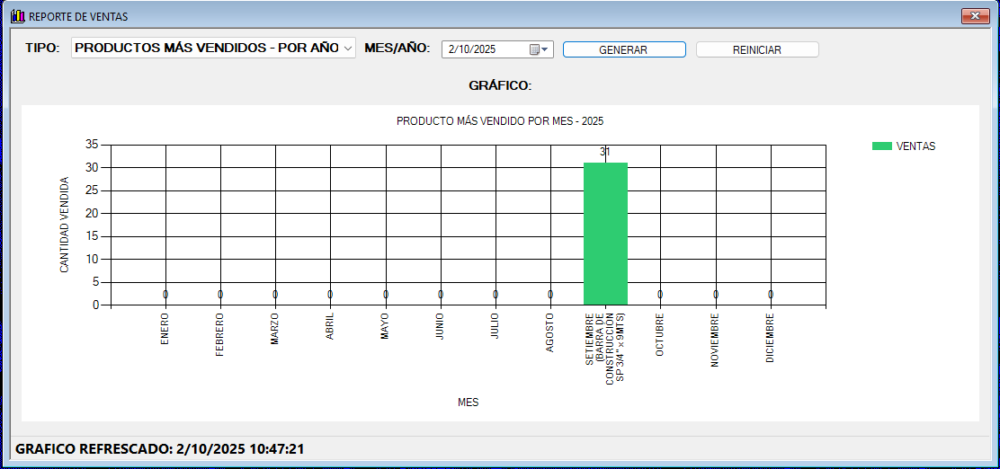

Herramientas
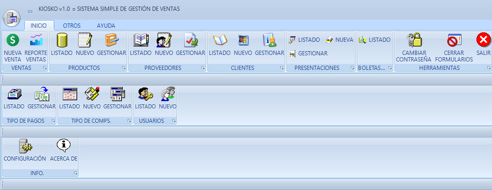
